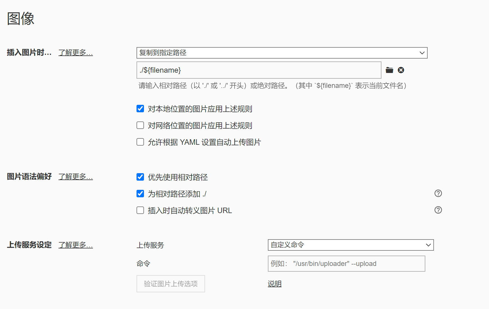

# init

### wsl2 ubuntu 20.04

https://blog.csdn.net/u011119817/article/details/130745551

- nvidia driver intergration


### github

- add ssh key : https://docs.github.com/zh/authentication/connecting-to-github-with-ssh/adding-a-new-ssh-key-to-your-github-account
- 


### typora

- active: https://github.com/markyin0707/typora-activation
- image configuration




helix
```bash
sudo add-apt-repository ppa:maveonair/helix-editor 
sudo apt update 
sudo apt install helix
```
[【推荐】后现代风格文本编辑器-Helix - Tmacy - 博客园 (cnblogs.com)](https://www.cnblogs.com/tmacy/p/17916523.html)

## nvim - lunarvim

```bash title="install thel latest nvim"
bash <(curl -s https://raw.githubusercontent.com/LunarVim/LunarVim/rolling/utils/installer/install-neovim-from-release)
```

```bash title:"unistall lunarvim"
bash ~/.local/share/lunarvim/lvim/utils/installer/uninstall.sh
```

```bash title="pre lunarvim"
sudo apt install python3-pip
sudo apt install cargo
sudo snap install rustup --classic
## need update rustc if need
rustup update stable
bash

```
[安装 | LunarVim](https://www.lunarvim.org/zh-Hans/docs/installation)
```
LV_BRANCH='release-1.4/neovim-0.9' bash <(curl -s https://raw.githubusercontent.com/LunarVim/LunarVim/release-1.4/neovim-0.9/utils/installer/install.sh)
```

```bash title="add PATH"
export PATH=/home/zkuang/.local/bin:$PATH
```


### keybind
[键位总览 | LunarVim](https://www.lunarvim.org/zh-Hans/docs/beginners-guide/keybinds-overview)


